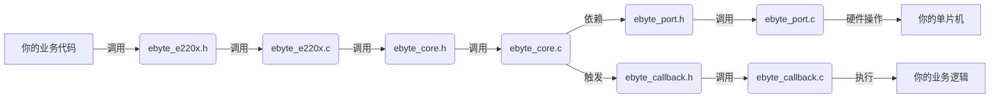

#IC

### 驱动文件描述
![[Pasted image 20260527200150.png]]
文件夹内：
![[Pasted image 20260527200203.png]]

关于这个芯片的官方驱动，总共就这么些文件。其中：
#### 🔧 一、核心驱动层（无需修改，官方实现）
> **作用**：实现 LoRa 芯片的底层寄存器操作和通信协议

| 文件                 | 功能说明                                                                             | 重要性   |
| ------------------ | -------------------------------------------------------------------------------- | ----- |
| **`ebyte_core.c`** | **驱动核心引擎**  <br>• 芯片寄存器配置（SX1262/SX1268）  <br>• 状态机管理（发送/接收状态转换）  <br>• 数据包编解码逻辑 | ⭐⭐⭐⭐⭐ |
| **`ebyte_core.h`** | 核心驱动头文件  <br>• 声明内部函数和数据结构  <br>• **用户不可直接调用**                                   | ⭐⭐⭐   |
| **`ebyte_conf.h`** | **配置开关文件**  <br>• 通过宏定义开启/关闭功能（如是否启用中断）  <br>• 设置参数范围（如最大包长）                     | ⭐⭐    |

---

#### 🧩 二、用户接口层（需调用，无需修改） 
> **作用**：提供给用户直接调用的 API 接口

| 文件                  | 功能说明                                                                                                                     | 重要性   |
| ------------------- | ------------------------------------------------------------------------------------------------------------------------ | ----- |
| **`ebyte_e220x.c`** | **用户 API 实现**  <br>• 实现你列出的所有函数：  <br>`Ebyte_E220x_Init()`  <br>`Ebyte_E220x_SendPayload()`  <br>`Ebyte_E220x_SetRx()` 等 | ⭐⭐⭐⭐⭐ |
| **`ebyte_e220x.h`** | **用户 API 头文件**  <br>• 声明所有对外接口函数  <br>• 业务代码必须包含此文件                                                                      | ⭐⭐⭐⭐  |

> [!NOTE]  使用方式
> ```c
> #include "ebyte_e220x.h" 
> int main() { 
> Ebyte_E220x_Init(); // 初始化模块 
> Ebyte_E220x_SetRfFrequency(433); // 设置433MHz 
> Ebyte_E220x_SendPayload(data, 10); // 发送10字节数据 
> }
> ```

### 🔌 三、硬件适配层（**必须修改**）
> **作用**：连接官方驱动与你的单片机硬件（**关键修改点！**）

|文件|功能说明|需要你修改的内容|
|---|---|---|
|**`ebyte_port.c`**|**硬件接口实现**  <br>• SPI 读写函数  <br>• GPIO 控制（NSS/RESET/BUSY）  <br>• 延时函数|✅ **必须实现**：  <br>1. 用你的单片机 SPI 替换 `Ebyte_Port_SPI_*`  <br>2. 用你的 GPIO 驱动替换 `Ebyte_Port_NSS_Set`  <br>3. 用 `HAL_Delay` 实现 `Delay_ms/us`|
|**`ebyte_port.h`**|**硬件接口声明**  <br>• 定义芯片连接的引脚宏  <br>• 声明底层函数|✅ **必须修改**：  <br>1. 根据你的电路板修改引脚定义：  <br>`c<br>#define EBYTE_NSS_PIN GPIO_PIN_4<br>#define EBYTE_RESET_PIN GPIO_PIN_5<br>`|

> ⚠️ **重点提醒**：  
> 这是**唯一需要你动手修改的文件**！所有硬件差异（STM32/ESP32/GD32）都在这里适配。我们需要把文件中的函数以我们所选芯片的方法实现，具体函数如下：

| 函数名                                                          | 需要你实现的功能                      |
| :----------------------------------------------------------- | :---------------------------- |
| `void Ebyte_Port_SPI_Init(void)`                             | 初始化 SPI 通信                    |
| `void Ebyte_Port_SPI_WriteByte(uint8_t data)`                | 通过 SPI 写一个字节                  |
| `uint8_t Ebyte_Port_SPI_ReadByte(void)`                      | 通过 SPI 读一个字节                  |
| `void Ebyte_Port_NSS_Set(uint8_t level)`                     | 控制 NSS (CS) 引脚  <br>（低电平选中芯片） |
| `void Ebyte_Port_RESET_Set(uint8_t level)`                   | 控制 RESET 引脚  <br>（低电平复位芯片）    |
| `uint8_t Ebyte_Port_BUSY_Get(void)`                          | 读取 BUSY 引脚状态 <br>（高电平表示芯片忙）   |
| `void Ebyte_Port_Delay_ms(uint32_t ms)`                      | 毫秒级延时                         |
| `void Ebyte_Port_Delay_us(uint32_t us)`                      | 微秒级延时                         |
| `void Ebyte_Port_Interrupt_Register(void (*callback)(void))` | 注册 DIO1 中断回调  <br>（关键！）       |

---

### 📡 四、事件回调层（可选修改）
> **作用**：处理异步事件（如接收数据完成）

|文件|功能说明|需要你修改的内容|
|---|---|---|
|**`ebyte_callback.c`**|**事件处理实现**  <br>• 接收完成回调  <br>• 发送完成回调|✅ **推荐修改**：  <br>实现你的业务逻辑：  <br>`c<br>void Ebyte_E220x_ReceiveCallback(uint8_t* data, uint8_t size) {<br> // 你的数据处理代码<br>}<br>`|
|**`ebyte_callback.h`**|回调函数声明  <br>• 定义回调函数类型  <br>• 声明注册接口|⚠️ 通常只需包含头文件|

> 💡 **使用场景**：  
> 当模块收到数据时，驱动会自动调用你实现的 `Ebyte_E220x_ReceiveCallback()`，无需轮询。





