#esp32 

[入门指南 - ESP32-S3 - — ESP-SR latest 文档](https://docs.espressif.com/projects/esp-sr/zh_CN/latest/esp32s3/getting_started/readme.html)

乐鑫 [ESP-SR](https://github.com/espressif/esp-sr) 可以帮助用户基于 ESP32 系列芯片或 ESP32-S3 系列芯片，搭建 AI 语音解决方案。本文档将通过一些简单的示例，展示如何使用 ESP-SR 中的算法和模型。

---


### 概述

ESP-SR 支持以下模块：

- [声学前端算法 AFE（回声消除）](https://docs.espressif.com/projects/esp-sr/zh_CN/latest/esp32s3/audio_front_end/README.html)
- [唤醒词检测 WakeNet](https://docs.espressif.com/projects/esp-sr/zh_CN/latest/esp32s3/wake_word_engine/README.html)
- [命令词识别 MultiNet](https://docs.espressif.com/projects/esp-sr/zh_CN/latest/esp32s3/speech_command_recognition/README.html)
- [语音合成（目前只支持中文）](https://docs.espressif.com/projects/esp-sr/zh_CN/latest/esp32s3/speech_synthesis/readme.html)
> 想要实现SR功能，需要先对`ES8311`进行驱动编写[[II_代码实操/IC-ES8311|IC-ES8311]]
---

### 语音处理完整链路

```mermaid
gantt
    title ESP-SR 语音唤醒处理全链路
    dateFormat  X
    axisFormat  %
    
    section 音频前端处理
    麦克风采集     :p1, 0, 12
    PCM音频输出    :p2, after p1, 12
    AEC回声消除    :p3, after p2, 12
    NS降噪处理     :p4, after p3, 12
    AGC自动增益    :p5, after p4, 12
    VAD人声检测    :p6, after p5, 12
    
    section 唤醒与识别
    无人说话·空闲循环 :b1, after p6, 20
    有人说话·WakeNet检测 :b2, after p6, 25
    唤醒命中·MultiNet识别 :b3, after b2, 20
    指令解析·文本输出 :b4, after b3, 12
    业务执行·GPIO/联网/LLM :b5, after b4, 25
    
    note right of b1 : 无语音 → 回到麦克风重新采集
    note right of b2 : 未命中唤醒词 → 继续监听
    note right of b5 : 控制硬件 / 联网 / 调用大模型
```




```
[I2S Mic]
    ↓
audio frame（每 10ms）
    ↓
esp-sr
    ↓
event callback
    ↓
你的业务逻辑（GPIO / UART / MQTT）
```