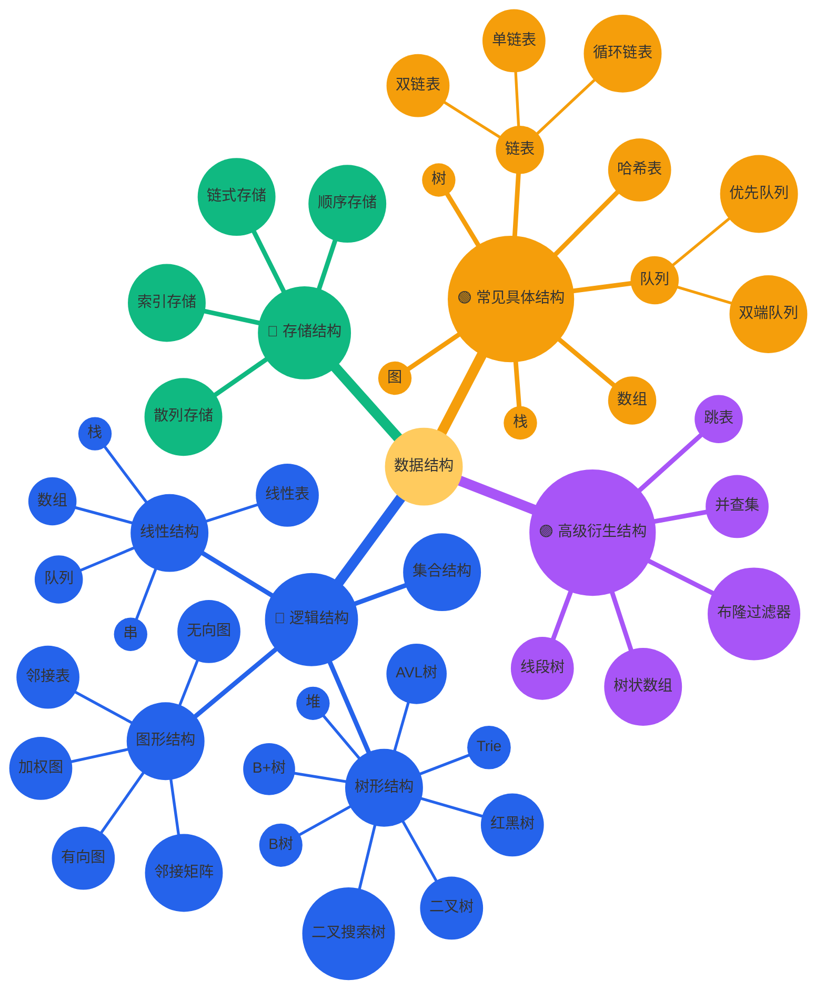

```mermaid
%%{init: {'theme': 'base', 'themeVariables': {
  'cScale0': '#0F172A',
  'cScale1': '#2563EB',
  'cScale2': '#10B981',
  'cScale3': '#F59E0B',
  'cScale4': '#A855F7',
  'cScale5': '#EF4444'
}}}%%
mindmap
  root((数据结构))
    ((🔷 逻辑结构))
      ((集合结构))
      ((线性结构))
        ((线性表))
        ((栈))
        ((队列))
        ((串))
        ((数组))
      ((树形结构))
        ((二叉树))
        ((二叉搜索树))
        ((AVL树))
        ((红黑树))
        ((堆))
        ((B树))
        ((B+树))
        ((Trie))
      ((图形结构))
        ((有向图))
        ((无向图))
        ((加权图))
        ((邻接矩阵))
        ((邻接表))
    ((🔶 存储结构))
      ((顺序存储))
      ((链式存储))
      ((索引存储))
      ((散列存储))
    ((🟢 常见具体结构))
      ((数组))
      ((链表))
        ((单链表))
        ((双链表))
        ((循环链表))
      ((栈))
      ((队列))
        ((双端队列))
        ((优先队列))
      ((哈希表))
      ((树))
      ((图))
    ((🟣 高级衍生结构))
      ((并查集))
      ((线段树))
      ((树状数组))
      ((跳表))
      ((布隆过滤器))
```
