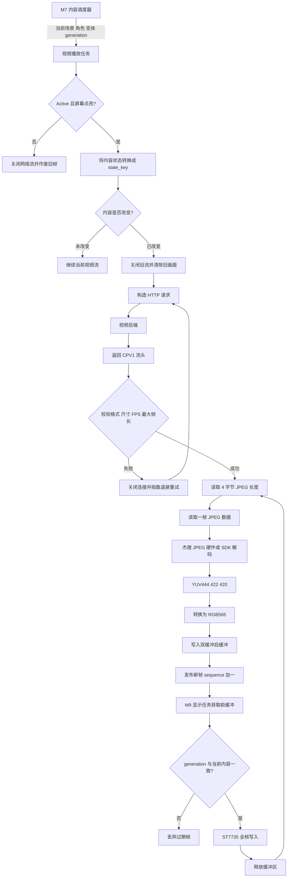

```mermaid
flowchart TD
    A[M7 内容调度器] -->|当前场景 角色 变体 generation| B[视频播放任务]
    B --> C{Active 且屏幕点亮?}

    C -->|否| D[关闭网络流并作废旧帧]
    C -->|是| E[将内容状态转换成 state_key]

    E --> F{内容是否改变?}
    F -->|未改变| G[继续当前视频流]
    F -->|已改变| H[关闭旧流并清除旧画面]

    H --> I[构造 HTTP 请求]
    I --> J[视频后端]
    J --> K[返回 CPV1 流头]

    K --> L{校验格式 尺寸 FPS 最大帧长}
    L -->|失败| M[关闭连接并指数退避重试]
    L -->|成功| N[读取 4 字节 JPEG 长度]

    N --> O[读取一帧 JPEG 数据]
    O --> P[杰理 JPEG 硬件或 SDK 解码]
    P --> Q[YUV444 422 420]
    Q --> R[转换为 RGB565]
    R --> S[写入双缓冲后缓冲]
    S --> T[发布新帧 sequence 加一]

    T --> U[M9 显示任务获取前缓冲]
    U --> V{generation 与当前内容一致?}
    V -->|否| W[丢弃过期帧]
    V -->|是| X[ST7735 全帧写入]
    X --> Y[释放缓冲区]
    Y --> N

    M --> I
```